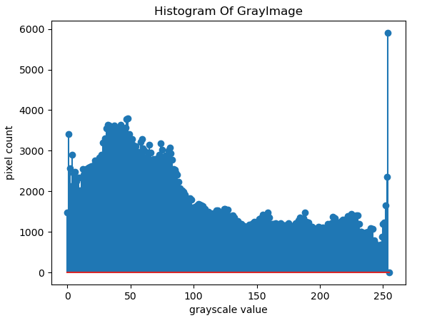

# HISTOGRAM
# Histogram and Histogram Equalization of an image
## Aim
To obtain a histogram for finding the frequency of pixels in an Image with pixel values ranging from 0 to 255. Also write the code using OpenCV to perform histogram equalization.

## Software Required:
Anaconda - Python 3.7

## Algorithm:
### Step1:
Import necessary libraries
<br>

### Step2:
Use cv2.calcHist(images, channels, mask, histSize, ranges[, hist[, accumulate]]) to find the histogram of the image.
<br>

### Step3:
Plot the image and its stem plots using the plt.show() and plt.stem() functions.
<br>

### Step4:
Equalize the grayscale image (cv2.equalizeHist().)
<br>

### Step5:
Print and end the program.
<br>

## Program:
```python
# Developed By: Sneha Basyal M
# Register Number: 212222240101

import cv2
import matplotlib.pyplot as plt

#Code to display gray scale image and color image.

Gray_image= cv2.imread('grImage.jpg')
Color_image= cv2.imread('scene.jpg')
plt.imshow(Gray_image)
plt.show()
plt.imshow(Color_image)
plt.show()

# Write your code to find the histogram of gray scale image and color image channels.

## For GrayImage
gray_image =cv2.imread('grImage.jpg',0)
cv2.waitKey(0)
cv2.destroyAllWindows()

hist = cv2.calcHist([gray_image],[0],None,[256],[0,255])

## For ColorImage
color_image =cv2.imread('scene.jpg',-1)
cv2.waitKey(0)
cv2.destroyAllWindows()

### For Blue channel
hist0 = cv2.calcHist([color_image],[0],None,[256],[0,255])
### For Green channel
hist1 = cv2.calcHist([color_image],[1],None,[256],[0,255])
### For Red channel 
hist2 = cv2.calcHist([color_image],[2],None,[256],[0,255])

# Display the histogram of gray scale image and channels histogram from color image

## For GrayImage
plt.figure()
plt.title("Histogram Of GrayImage")
plt.xlabel('grayscale value')
plt.ylabel('pixel count')
plt.stem(hist)
plt.show()

## For ColorImage

## For Blue channel
plt.figure()
plt.title("Histogram Of Blue Channel")
plt.xlabel('blue value')
plt.ylabel('pixel count')
plt.stem(hist0)
plt.show()

## For Green channel
plt.figure()
plt.title("Histogram Of Green Channel")
plt.xlabel('green value')
plt.ylabel('pixel count')
plt.stem(hist1)
plt.show()

## For Red channel
plt.figure()
plt.title("Histogram Of Red Channel")
plt.xlabel('red value')
plt.ylabel('pixel count')
plt.stem(hist2)
plt.show()

# Write the code to perform histogram equalization of the image. 
equ_image = cv2.equalizeHist(gray_image)

equal_hist = cv2.calcHist([equ_image],[0],None,[256],[0,255])

plt.figure()
plt.title("Histogram Of Equalized Image")
plt.xlabel('grayscale value')
plt.ylabel('pixel count')
plt.stem(equal_hist)
plt.show()
```
## Output:
## Input Grayscale Image and Color Image

<br>
<br>
<br>
<br>

## Histogram of Grayscale Image and channels of Color Image
## For GrayImage

<br>

## For Blue Channel

<br>

## For Green Channel

<br>

## For Red Channel

<br>

## Histogram Equalization of Grayscale Image


<br>


<br>

## Result: 
Thus the histogram for finding the frequency of pixels in an image with pixel values ranging from 0 to 255 is obtained. Also,histogram equalization is done for the gray scale image using OpenCV.
